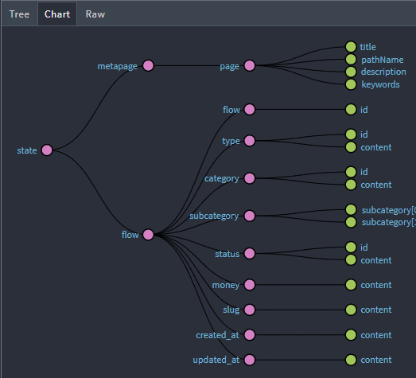
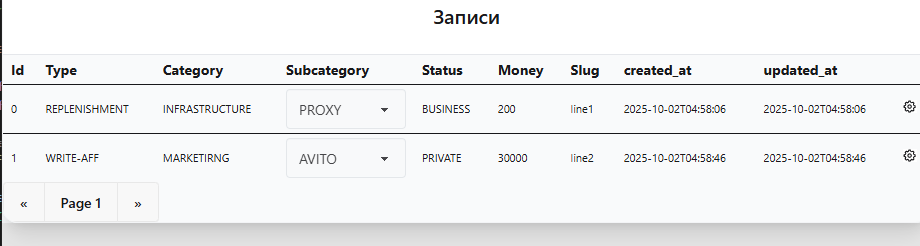
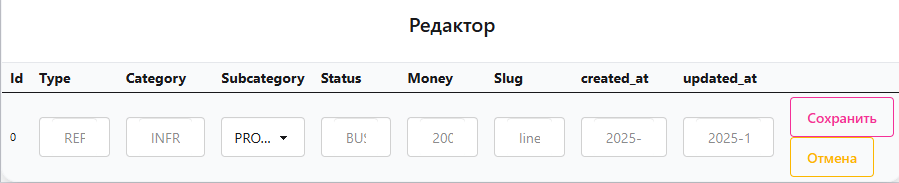

## Redux
\
Работает с мета-данными для страницы и данные которые передаём для редактирования.

## Публикации


- Подкатегории содержат список , но в режиме - публикации, свой выбор сделать вы не сможете. Только при редактировании.
- Редактировать - правая крайная ячейка с шестирёнкой.

## Редактор



живое изменение. 
ограниченный выбор

```text

Имя	
├──.husky/
├──.vscode/
├──dist/
├──img/
├──public/
├──src/
│   ├── app/
│   ├── classes/
│   │   ├──*.css
│   ├── components/
│   │   ├──components/
│   │   │   ├──Main/
│   │   │   │   ├──handlers/
│   │   │   │   ├──index.tsx
│   │   │   │   ├──style.css
│   │   │   │   ├──tasks.ts
│   │   │   ├──Router/
│   │   │   │   ├──index.tsx	
│   │   │   ├──Settings/
│   │   │   │   ├──handlers/
│   │   │   │   ├──index.tsx
│   │   │   │   ├──tasks.ts
│   │   │   ├──App.tsx
│   │   │   ├──style.css
│   ├──fields/
│   │   ├──*.tsx		
│   ├── map/
│   ├── redux/
│   │   ├──features/
│   │   │   ├──cellSubcategories/
│   │   │   ├──pagestate/
│   │   │   ├──tableRow/
│   │   │   ├──*.ts
│   ├── services/
│   │   │   ├──*.ts
│   ├── styles/
│   │   │   ├──*.css
│   ├── index.ts
│   ├── interfaces.ts
│   ├── output.css
├──.browserslistrc
├──.editorconfig
├──.env	
├──.gitignore
├──babel.config.js
├──eslint.config.js
├──package.json	
├──postcss.config.js
├──README.md
├──swagger(4).json
├──tailwind.config.js
├──tsconfig.json
├──webpack.config.init.js
├──webpack.config.js
```