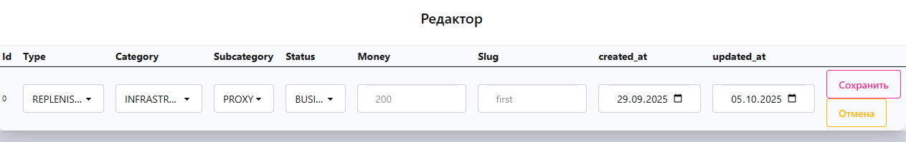

Backend: [https://github.com/Tryd0g0lik/flows](https://github.com/Tryd0g0lik/flows)

Используя команду "`GIT CLONE`", файлы разместите в директории "`frontend`" согласно дереву. 

```text
Ваше_имя_локальное	
├──frontend/
├──backend/
```

## Основные зависимости

||||
|:----|:----|:----|
|"`@reduxjs/toolkit`"|"`react`"|"`react-dom`"|
|"`react-redux`"|"`react-router`"|"`react-scripts`"|
||||

## Маршруты
- Redux: "`src\redux`";
- Components: "`src\components`";
- Some components: "`src\components\ui`";
- SImple scripts: "`src\services`";
- Template html: "`public/`".


## Redux
\
Работает с мета-данными для страницы и данные которые передаём для редактирования.

## Публикации


- Подкатегории содержат список , но в режиме - публикации, свой выбор сделать вы не сможете. Только при редактировании.
- Редактировать - правая крайная ячейка с шестирёнкой.

### Загрузчик 
На момент когда запрос обрабатывается уже на стороне сервера, браузер имеет анимацию загрузки.\


## Редактор
Режим редактирования строки.\


Для редактирровани одной строки, нажмите на шестирёнку в правой крайней колонке.\

#### Note
 При нажатии на шестирёнку, строка и данные должны быть представлены на отдельной от всего списка странице. Если это не произошло, просто нажмите "`F5`" или "`Ctrl+R`". Видимо что-то пошло не поплану при загрузке страницы с общим списком.

### Type & Status
\
Согласно ТЗ, колонки не имеют зависимости и [имеют возможность расширяться](https://github.com/Tryd0g0lik/flows).\
Имеем возможность выбора наименований в колонках "`Type`" & "`Status`".

### Category & Subcategory
\
Согласно ТЗ
>> Подкатегории должны быть привязаны к категориям.

На [этапе создания категории](https://github.com/Tryd0g0lik/flows) привязываем "подкатегорию".\
На стороне браузера, каждая категоря работает только в рамках привязанных к ней подкатегорий.\
В режиме радактирования записи, при попытке изменить имя категории (не переименовать), колонка "`Subcategory`" изменяет список автоматически.\
В колонке "`Subcategory`" для выбора представлен список лишь тех наименований "`Subcategory`" которые бли присвоенны "`Сategory`"на этапе создания "`Category`".


### Money & Slog & created_at 
Данные редактируются без особенностей согласно ТЗ.

### updated_at
Колонка предоставлена для обзора. По плану внесённые в неё изменения не должны были сохраняться. [*Про общее сохранение отдельно*](#кнопка-сохранить).

### Кнопка "Отмена".
В любой момент она вас возвращает на исходную страницу с  общим списком записей. 

### Кнопка "Сохранить".
За 5 дней (срок согласно ТЗ) на стороне браузера реалиховать CRUD просто не успел.\
Зато, все задачи в ТЗ по:
- сортировкам;
- CRUD;
- филтры;
- поиск [реализованы на стороне сервера](https://github.com/Tryd0g0lik/flows). Достаточно войти в админ панель.\
Согласно ТЗ - привязки к роли и ограничениям пользователя - нет.


## Дерево проекта
```text

Имя	
├──.husky/
├──.vscode/
├──dist/
├──img/
├──public/
│   ├──*.html
├──src/
│   ├── components/
│   │   ├──Main/
│   │   │   ├──handlers/
│   │   │   │   ├──*.ts
│   │   │   ├──index.tsx
│   │   │   ├──style.css
│   │   │   ├──tasks.ts
│   │   ├──Router/
│   │   │   ├──index.tsx	
│   │   ├──Settings/
│   │   │   ├──handlers/
│   │   │   │   ├──*.ts
│   │   │   ├──index.tsx
│   │   │   ├──tasks.ts
│   │   ├──App.tsx
│   │   ├──style.css
│   │   ├──ui/
│   │   │   ├──*.tsx		
│   ├── map/
│   ├── redux/
│   │   ├──features/
│   │   │   ├──cellSubcategories/
│   │   │   │   ├──*.ts
│   │   │   ├──pagestate/
│   │   │   │   ├──*.ts
│   │   │   ├──tableRow/
│   │   │   │   ├──*.ts
│   │   ├──*.ts
│   ├── services/
│   │   │   ├──*.ts
│   ├── styles/
│   │   │   ├──*.css
│   ├── index.ts
│   ├── interfaces.ts
│   ├── output.css
├──.browserslistrc
├──.editorconfig
├──.env	
├──.gitignore
├──babel.config.js
├──eslint.config.js
├──package.json	
├──postcss.config.js
├──README.md
├──swagger.json
├──tailwind.config.js
├──tsconfig.json
├──webpack.config.init.js
├──webpack.config.js
```

## Команды
- "`npm install package.json`" устанавливаем зависимости;
- "`npm run husk`" Старт перед "`prepare`". Перед началом, создать  файл (без разрешения)"`pre-commit`" по маршруту "`*./.husky`'. В файле "`pre-commit`" указать строку "`npm run lint`". Запуск возможен только если установлен "`GIT`" в проект;
---
- "`npm run prepare`": "husky".
- "`npm run lint`" - проверка стиля кода и ошибок. Плюс имеем  "`husk`" и  команд "`npm run lint`" автоматически запускается  при  "`git commit`". "`--no-verify`" который отменит проверку/запуск "`npm run lint`";
---
- "`npm run build:dev`" сборка в режиме "`development`" по маршруту "`./dist`".
- "`npm run build`" - сборка в режиме продакшион "`production`". Все файлы найдёте уже на стороне backend части проекта. Файлы появятся по маршруту "`../backend/static/scripts`" Перед сборкой измените данные "`APP_HOST`" в файле "`.ENV`" на стороне "`frontend`";
---
- "`npm run server`" - Старт локальный сервера для разработки;
- "`npm run cssstyle`" - запускается перед началом работ, но только после "`npm run server`". Формирует файл "`css`" с учетом используемых стилей и компонентов от "`tailwindcss.com`" & "`daisyui.com`";
---
- "`F5`" (клавиша) в режииме debug  запускается проект через браузер Chrome. Запускать только после запуска "`npm run server`";
- "`git log --all --oneline --graph --decorate --date=format:'%Y-%m-%d %H:%M:%S' --pretty=format:'%C(yellow)%h%C(auto)%d %C(white)%cd%Creset %s'`"  история развития проекта c datetime.


### Note
Маршруты "`map\another-module.ts`" хронят в себе зависимости и разрабатывая код на стороне сервера, можно работать в debug режиме с "`tsx`" файлами. Работает только если сборку провели в режиме "`development`".

## .ENV
```text
APP_HOST = < your_IP_or_domen >
APP_PORT = < port_of_your_site >
APP_PROTOCOL = http 
```

### Note
Дополнительные изменения по маршруту "`src\interfaces.ts`".
